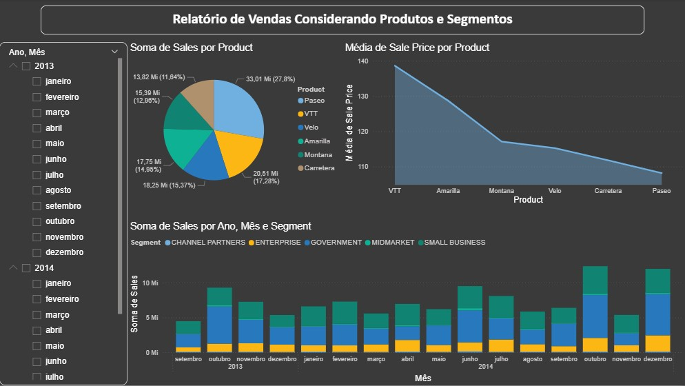

## 📊 Gráfico: Distribuição de Vendas por Produto

Este gráfico apresenta a soma total das vendas (`Sales`) agrupadas por produto, permitindo visualizar quais itens geraram maior receita. Utilizamos um gráfico de pizza para facilitar a comparação proporcional entre os produtos.

### 🔍 Objetivo

Visualizar a participação de cada produto no total de vendas, identificando os itens mais lucrativos e sua representatividade no portfólio.

### 🧠 Interpretação

- **Segmentos do gráfico**: Cada fatia representa um produto vendido:
  - VTT
  - Amarilla
  - Montana
  - Velo
  - Carretera
  - Paseo

- **Tamanho das fatias**: Proporcional à soma de vendas (`Sales`) por produto

- **Cores**: Cada produto é representado por uma cor distinta para facilitar a leitura

- **Destaque**: Apesar de **VTT** ser o produto com **maior preço médio**, ele apresenta **menor volume de vendas** comparado ao **Passeio**, que é o **produto mais barato** e lidera em participação de receita. Isso pode indicar maior demanda por itens acessíveis ou menor aceitação de produtos premium.

### 📈 Insights

- Produtos com menor preço unitário podem gerar maior volume de vendas e receita total.
- Itens de alto valor como VTT exigem estratégias específicas de posicionamento e marketing.
- A visualização ajuda a identificar oportunidades de promoção, reposicionamento ou foco comercial.

### 🛠️ Construção

- **Visual utilizado**: Gráfico de pizza
- **Campos utilizados**:
  - Legenda: `Product`
  - Valores: Soma de `Sales`

> Este gráfico é parte da análise de performance por produto e pode ser cruzado com dados de preço médio, margem de lucro e segmentação por país ou canal de vendas.
