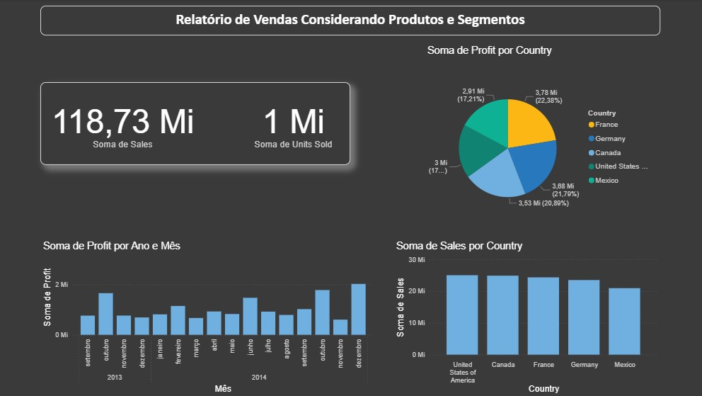

## 📊 Gráfico: Distribuição de Lucro por País

Este gráfico apresenta a soma total de lucro (`Profit`) agrupada por país, permitindo visualizar quais mercados geraram maior rentabilidade. Utilizamos um gráfico de pizza para facilitar a comparação proporcional entre os países.

### 🔍 Objetivo

Analisar a contribuição de cada país para o lucro total da empresa, identificando os mercados mais lucrativos e suas respectivas participações.

### 🧠 Interpretação

- **Segmentos do gráfico**: Cada fatia representa um país:
  - United States
  - Canada
  - Germany
  - France
  - Mexico

- **Tamanho das fatias**: Proporcional à soma de lucro (`Profit`) por país

- **Cores**: Cada país é representado por uma cor distinta para facilitar a leitura

- **Destaque**: Os **Estados Unidos** lideram com o maior lucro (2,91 Mi), seguidos por **Canadá** (1,76 Mi) e **Alemanha** (1,54 Mi). **México** apresenta o menor lucro entre os cinco países analisados (1,01 Mi), o que pode indicar menor margem ou volume de vendas.

### 📈 Insights

- Mercados como EUA e Canadá são os principais geradores de lucro, sendo estratégicos para expansão e investimento.
- Países com menor participação podem ser analisados para entender oportunidades de crescimento ou ajustes operacionais.
- A visualização permite avaliar a eficiência comercial por região.

### 🛠️ Construção

- **Visual utilizado**: Gráfico de pizza
- **Campos utilizados**:
  - Legenda: `Country`
  - Valores: Soma de `Profit`

> Este gráfico é parte da análise de rentabilidade por país e pode ser cruzado com dados de vendas, unidades vendidas e segmentação de clientes para decisões estratégicas.
